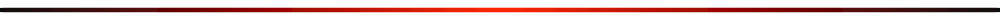
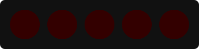
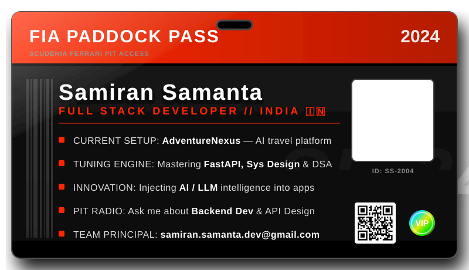
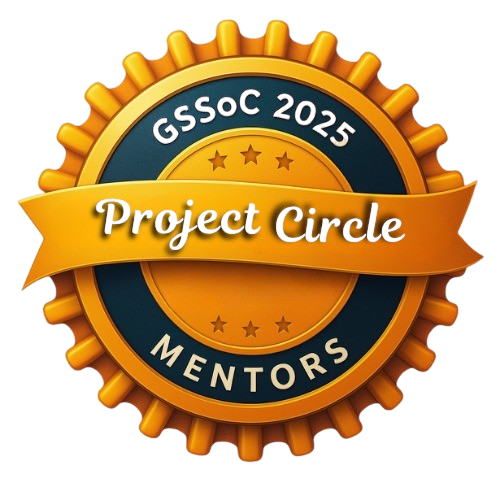
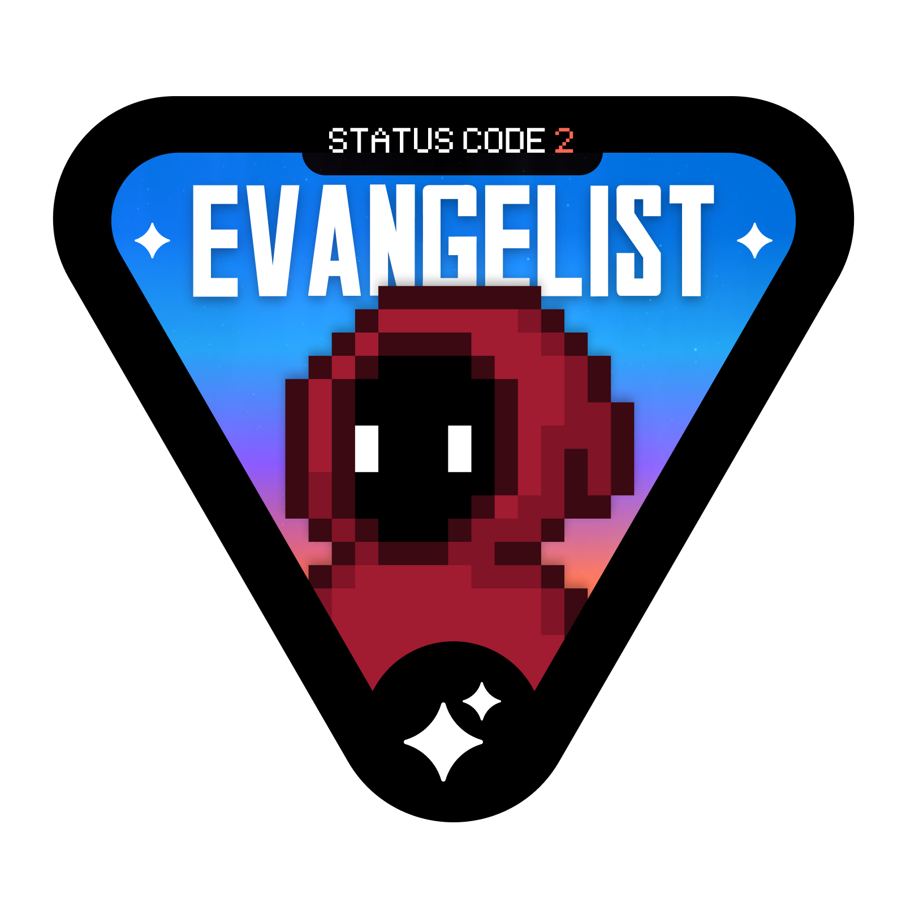
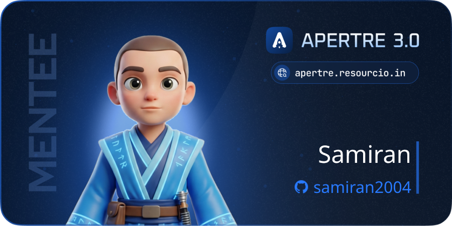
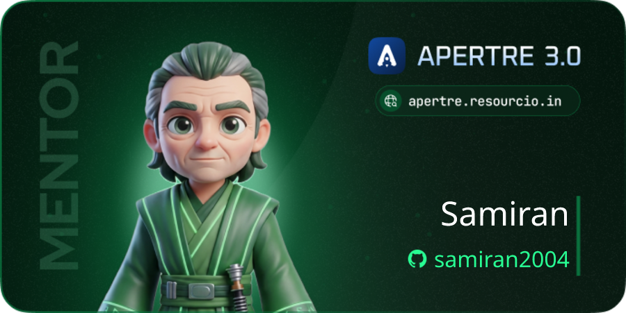

  

<h1 align="center">🏎️ FORZA FERRARI! Welcome to the Pit Stop! 🏁</h1>

  

  

##  🚦 Lights Out and Away We Go! — I'm Samiran Samanta!

A passionate **Full Stack Developer** from **India 🇮🇳**, engineering high-performance web apps with the precision of an F1 aerodynamicist.
I love turning ideas into reality through clean code, thoughtful architecture, and pushing the limits of speed and scalability!

  

> *"Can architect full-stack apps while sipping chai ☕, debug backends at 200mph 🏎️, and execute a perfect 2.0-second pit stop for code deployments!"*

 

### 🔗 Team Telemetry (Connect with Me)

  &nbsp;
  &nbsp;
  &nbsp;
  &nbsp;
  &nbsp;
  

  

## 🏎️ Scuderia Source Code (About Me)

  

  

## 🔧 Engineering Setup (Tech Stack & Tools)

  

  

## 🏁 Track Record (GitHub Stats)

<table width="100%" align="center">
  <tr>
    <td width="50%" align="center">
      <h4>📈 Championship Points (Summary)</h4>
      
    </td>
    <td width="50%" align="center">
      <h4>🔥 Lap Streak</h4>
      
    </td>
  </tr>
  <tr>
    <td width="50%" align="center">
      <h4>📌 Latest Upgrade (Project)</h4>
      
    </td>
    <td width="50%" align="center">
      <h4>🗂️ Engine Components (Top Languages)</h4>
      
    </td>
  </tr>
</table>

  

## 🏎️ Driver Standings (Competitive Stats)

<table width="100%" align="center">
  <tr>
    <td width="50%" align="center">
      <h4>
        
      </h4>
      
    </td>
    <td width="50%" align="center">
      <h4>
        
      </h4>
      
    </td>
  </tr>
</table>

  

## 🏆 Podium Finishes (Achievements)

  
  
  
  
  

 

  

  

## 🌟 Pit Wall Motivation

  
   
  

  

  

  <em>
    <b>🏁 The race doesn't stop here! 🏁</b> 
    If you want to talk about tech, code, or the next GP, my DMs are always open — jump into my pit lane! 🏎️
  </em>
    
  

