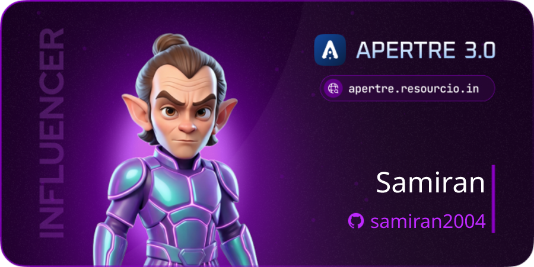

<p align="center">
  
</p>

<p align="center">
  <a href="https://github.com/Samiran2004">
    
  </a>
</p>

<p align="center">
  
  &nbsp;
  
  &nbsp;
  
  &nbsp;
  
  &nbsp;
  
</p>

---

##  নমস্কার (Namaste) 🙏🏻 — I'm Samiran Samanta!


A passionate **Full Stack Developer** from **India 🇮🇳**, building scalable web apps and AI-powered solutions.
I love turning ideas into reality through clean code, thoughtful architecture, and continuous learning.

- 🔭 Currently building **AdventureNexus** — an AI-powered travel planning platform
- 🌱 Mastering **FastAPI**, **System Design**, and sharpening **DSA** daily
- 🤖 Passionate about **AI / LLM integration** in real-world applications
- 💬 Ask me about **Full Stack Dev**, **Backend Engineering**, **API Design**, or **DSA**
- 📫 Reach me at **samiransamanta490@gmail.com**

 *"Can architect full-stack apps while sipping chai ☕, debug backends to Lo-Fi beats 🎵, and optimize APIs at 2 AM 🌙"*

<br clear="right"/>

### 🔗 Connect with Me

<p>
  <a href="https://x.com/SmrSmt147270" target="_blank">
    
  </a>&nbsp;
  <a href="https://www.linkedin.com/in/samiransamanta/" target="_blank">
    
  </a>&nbsp;
  <a href="https://github.com/Samiran2004" target="_blank">
    
  </a>&nbsp;
  <a href="https://samiransamantaportfolio.netlify.app/" target="_blank">
    
  </a>&nbsp;
  <a href="https://leetcode.com/u/SAMIRAN2004/" target="_blank">
    
  </a>&nbsp;
  <a href="https://www.geeksforgeeks.org/user/samiransaats0/" target="_blank">
    
  </a>
</p>

<a href="https://trendshift.io/developers/2235" target="_blank">
  
</a>

---

##  About Me in Code

```javascript
const Samiran = {
    pronouns      : "He / Him",
    code          : ["Python", "JavaScript", "Java"],
    askMeAbout    : [
                      "full stack dev",  "AI integration",  "backend dev",
                      "DSA",             "mobile dev",       "data engineering",
                      "API development"
                    ],
    technologies  : {
        frontEnd  : {
            web   : ["React", "Tailwind CSS", "Shadcn/ui", "HTML5", "CSS3"],
            mobile: ["React Native"]
        },
        backEnd   : {
            js    : ["Node.js", "Express.js"],
            python: ["FastAPI"]
        },
        ai        : ["Groq AI", "GPT", "Chatbot", "LLM Integration"],
        devOps    : ["Docker", "Vercel", "Render", "Railway"],
        cloud     : { aws: ["EC2 (basic)", "S3 (basic)"], db: ["MongoDB Atlas", "Redis Cloud"] },
        databases : ["MongoDB", "Redis", "MySQL"],
        auth      : ["Clerk", "JWT"],
        misc      : ["Postman", "Swagger", "Socket.IO", "Twilio", "Git", "Axios"],
        apis      : ["REST APIs", "Third-party Integration", "Pollinations AI"],
        payments  : ["Razorpay (integrating)"]
    },
    architecture  : {
        backEnd   : ["REST APIs", "MVC", "Microservices (learning)"],
        databases : ["NoSQL", "In-memory", "Relational"],
        fullStack : ["React + Express.js + MongoDB", "React Native + Node.js"],
        ai        : ["AI-powered recommendation systems", "Content generation"]
    },
    currentFocus  : "Building AI-powered apps, mastering FastAPI & strengthening DSA in Python",
    featuredProject: {
        name  : "AdventureNexus — AI Travel Planner",
        tech  : ["React", "Express.js", "MongoDB", "Groq AI", "Clerk", "Redis"],
        impact: "80% time reduction · 92% satisfaction · 95% retention"
    }
};
```

---

## 🛠️ Tech Stack & Tools

<p align="center">
  
  
  
  
  
  
  
  
  
  
  
  
  
  
  
  
  
  
  
  
  
  
  
</p>

---

## ⭐ Favorite Tech

<table align="center">
  <tr>
    <td align="center" width="100">
      <br/>
      <sub><b>Python</b></sub>
    </td>
    <td align="center" width="100">
      <br/>
      <sub><b>JavaScript</b></sub>
    </td>
    <td align="center" width="100">
      <br/>
      <sub><b>Java</b></sub>
    </td>
    <td align="center" width="100">
      <br/>
      <sub><b>Linux</b></sub>
    </td>
    <td align="center" width="100">
      <br/>
      <sub><b>Docker</b></sub>
    </td>
    <td align="center" width="100">
      <br/>
      <sub><b>AWS</b></sub>
    </td>
    <td align="center" width="100">
      <br/>
      <sub><b>IntelliJ IDEA</b></sub>
    </td>
    <td align="center" width="100">
      <br/>
      <sub><b>VS Code</b></sub>
    </td>
    <td align="center" width="100">
      <br/>
      <sub><b>FastAPI</b></sub>
    </td>
    <td align="center" width="100">
      <br/>
      <sub><b>Node.js</b></sub>
    </td>
  </tr>
</table>

---

## 🏆 Achievements & Open Source

<p align="center">
  <a href="https://drive.google.com/file/d/1VsqsBivfrLfqCFwuMXgv2k3WK3E_0TIp/view" target="_blank" rel="noopener noreferrer">
    
  </a>&nbsp;&nbsp;
  <a href="https://badgr.com/public/assertions/6CmfzKiWR1yQxjybAJ3qvA?identity__email=samiransamanta490@gmail.com" target="_blank" rel="noopener noreferrer">
    
  </a>&nbsp;&nbsp;
  &nbsp;&nbsp;
  &nbsp;&nbsp;
  &nbsp;&nbsp;
  &nbsp;&nbsp;
  &nbsp;&nbsp;
  
</p>

<p align="center">
  <a href="https://holopin.io/@samiran2004">
    
  </a>
</p>

---

## 📊 GitHub Stats

<table width="100%" align="center">
  <tr>
    <td width="50%" align="center">
      <h4>📈 Profile Summary</h4>
      
    </td>
    <td width="50%" align="center">
      <h4>🔥 Streak Stats</h4>
      
    </td>
  </tr>
  <tr>
    <td width="50%" align="center">
      <h4>📌 Latest Project</h4>
      <a href="https://github.com/Samiran2004/Habitlog">
        
      </a>
    </td>
    <td width="50%" align="center">
      <h4>🏅 Top Contributions</h4>
      
    </td>
  </tr>
  <tr>
    <td width="50%" align="center">
      <h4>🗂️ Top Languages</h4>
      
    </td>
    <td width="50%" align="center">
      <h4>🎯 GitRoll Profile</h4>
      <a href="https://gitroll.io/profile/uyPmI3oeVbcZBLTF5dEEgzSypoUH3" target="_blank">
        
      </a>
    </td>
  </tr>
</table>

---

## 💻 Competitive Programming Stats

<table width="100%" align="center">
  <tr>
    <td width="50%" align="center">
      <h4>
        
        &nbsp; LeetCode
      </h4>
      <a href="https://leetcode.com/u/SAMIRAN2004/">
        
      </a>
    </td>
    <td width="50%" align="center">
      <h4>
        
        &nbsp; GeeksForGeeks
      </h4>
      <a href="https://www.geeksforgeeks.org/user/samiransaats0/">
        
      </a>
    </td>
  </tr>
</table>

---

## 🌟 Thought of the Day

<p align="center">
  
</p>

---

<p align="center">
  
  <br/><br/>
  <em>
    <b>I love connecting with people from around the world.</b><br/>
    If you want to say <b>hi</b>, my DMs are always open — I'll be happy to connect! 😊
  </em>
  <br/><br/>
  
</p>

<p align="center">
  
</p>
