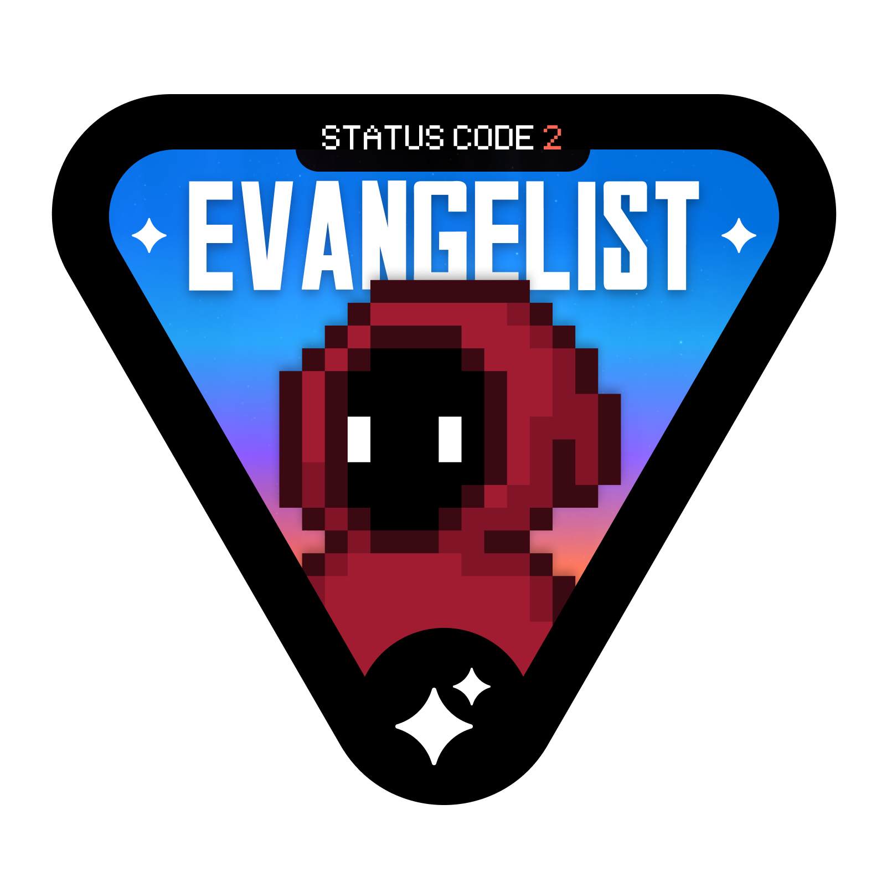

<p align="center">
  <a href="https://github.com/Samiran2004">
    
  </a>
</p>


<h2> নমস্কার (Namaste)🙏🏻, I'm Samiran! </h2>

<p><em>A passionate self-taught backend developer from india. my passion for software lies with dreaming up ideas and making them come true.
</a> 
</em></p>

[](https://x.com/SmrSmt147270)
[](https://www.linkedin.com/in/samiransamanta/)

[](https://samiransamantaportfolio.netlify.app/)

<a href="https://trendshift.io/developers/2235" target="_blank"></a>

###  A little more about me...  

```javascript
const Samiran = {
    pronouns: "He" | "Him",
    code: ["JavaScript", "TypeScript", "Java", "Python", "Bash"],
    askMeAbout: ["backend dev", "DSA", "mobile dev", "CS fundamentals"],
    technologies: {
        frontEnd: {
            mobile: ["React Native", "Android (Java)"],
            web: ["HTML", "CSS"]
        },
        backEnd: {
            js: ["Node.js", "Express.js"],
            java: ["Spring Boot (basic)"]
        },
        devOps: [], // Paused for now
        cloudServices: {
            aws: ["EC2 (basic)", "S3 (basic)"]
        },
        databases: ["MongoDB", "Redis"],
        misc: ["Postman", "Swagger", "Socket.IO", "Twilio"],
        generativeAI: ["Chatbot", "GPT"]
    },
    architecture: {
        backEnd: ["REST APIs", "MVC"],
        databases: ["NoSQL", "In-memory"],
        fullStack: ["React Native + Node.js"]
    },
    currentFocus: "Building cross-platform mobile apps and strengthening DSA skills in Java",
    funFact: "Can debug tricky backend flows while sipping chai ☕ and vibing to Lo-Fi beats 🎵"
};

```

 <em><b>I love connecting with different people</b> so if you want to say <b>hi, I'll be happy to meet you more!</b> 😊</em>

<br/>
- 

**languages and tools:**  

<code></code>
<code></code>
<code></code>
<code></code>
<code></code>
<code></code>
<code></code>
<code></code>
<code></code>
<code></code>
<code></code>
<code></code>
<code></code>
<code></code>
<code></code>
<code></code>
<code></code>
<code></code>
<code></code>
<code></code>
<code></code>
<code></code>
<code></code>
<code></code>
<code></code>

<br>

<h2 align="left" id="macropower-tech">Favorite Tech</h2>

> Tools, languages, and other things that I like to work with.

<table>
  <tr>
    <td align="center" width="96">
<!--       <a href=""> -->
        
<!--       </a> -->
      <br>Java
    </td>
    <td align="center" width="96">
<!--       <a href=""> -->
        
<!--       </a> -->
      <br>JavaScript
    </td>
    <td align="center" width="96">
<!--       <a href="#macropower-tech"> -->
        
<!--       </a> -->
      <br>Python
    </td>
    <td align="center" width="96">
<!--       <a href="#macropower-tech"> -->
        
<!--       </a> -->
      <br>Linux
    </td>
    <td align="center" width="96">
<!--       <a href="#macropower-tech"> -->
        
<!--       </a> -->
      <br>Docker
    </td>
    <td align="center" width="96"> 
<!--       <a href="#macropower-tech" > -->
        
<!--       </a> -->
      <br>AWS
    </td>
    <td align="center" width="96">
<!--       <a href=""> -->
        
<!--       </a> -->
      <br>Intellij IDEA
    </td>
    <td align="center" width="96">
<!--       <a href=""> -->
        
<!--       </a> -->
      <br>VS Code
    </td>
    <td align="center" width="96">
<!--       <a href=""> -->
        
<!--       </a> -->
      <br>Spring Boot
    </td>
    <td align="center" width="96">
<!--       <a href=""> -->
        
<!--       </a> -->
      <br>Node JS
    </td>
  </tr>
</table>


## <b>🆠Gɪᴛʜᴜʙ TÊ€á´á´˜ÊœÉªá´‡s ğŸ†</b>
<p align="center">
  <a href="https://github.com/Samiran2004/github-profile-trophy">
    
  </a>
</p>
<br />

## <b> Projects</b>
<br></br>

## <b> Leetcode Stats</b>
[](https://leetcode.com/u/SAMIRAN2004/)

## <b>📊 Gɪᴛʜᴜʙ Sᴛᴀᴛs 📊</b>

<table width="100%">
  <tr>
    <td width="50%">
      <h3 align="center"><strong>Gɪᴛʜᴜʙ Sᴛᴀᴛs</strong></h3>
      <p align="center">
        <a href="https://github.com/Samiran2004">
          
        </a>
      </p>
    </td>
    <td width="50%">
      <h3 align="center"><strong>Sᴛʀᴇᴀᴋ Sᴛᴀᴛs</strong></h3>
      <p align="center">
        <a href="https://github.com/Samiran2004">
          
        </a>
      </p>
    </td>
  </tr>
  <tr>
    <td width="50%">
      <h3 align="center"><strong>Lᴀᴛᴇsᴛ Pʀᴏᴊᴇᴄᴛ</strong></h3>
      <p align="center">
        <a href="https://github.com/Samiran2004/Habitlog">
          
        </a>
      </p>
    </td>
    <td width="50%">
      <h3 align="center"><strong>Tᴏᴘ Cᴏɴᴛʀɪʙᴜᴛɪᴏɴs</strong></h3>
      <p align="center">
        <a href="https://github.com/Samiran2004">
          
        </a>
      </p>
    </td>
  </tr>
  <tr>
     <td width="50%">
      <h3 align="center"><strong>Tᴏᴘ Language's</strong></h3>
      <p align="center">
        <a href="https://github.com/Samiran2004">
          
        </a>
      </p>
    </td>
  </tr>
</table>
<br />

## <b>🌟 Tʜᴏᴜɢʜᴛ ᴏғ ᴛʜᴇ Dᴀʏ 🌟</b>


<!--STARTS_HERE_QUOTE_CARD-->
<p align="center">
  
</p>

<!--ENDS_HERE_QUOTE_CARD-->

<!-- TODO-IST:END -->

## <b>📈 Cᴏɴᴛʀɪʙᴜᴛɪᴏɴ Gʀᴀᴘʜ 📈</b>

[](https://www.linkedin.com/in/samiransamanta/)

[](https://holopin.io/@samiran2004)

<p align="left">
  <a href="https://drive.google.com/file/d/1VsqsBivfrLfqCFwuMXgv2k3WK3E_0TIp/view" target="_blank" rel="noopener noreferrer">
  
</a>

<a href="https://badgr.com/public/assertions/6CmfzKiWR1yQxjybAJ3qvA?identity__email=samiransamanta490@gmail.com" target="_blank" rel="noopener noreferrer">
  
</a>

  
  
  
</p>


<h1 align='center'>⚡️<i>REBUILD IT!</i>⚡️</h1>

<p align="center">
        
</p>
